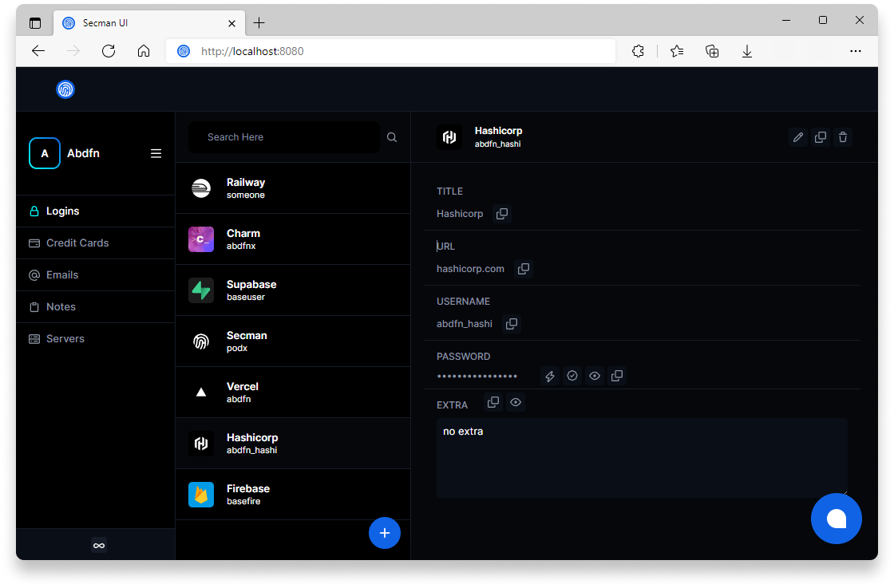

# Secman UI

<p align="center">
  
</p>

<p align="center">
  🗺️ Secman UI is your graphical secman.
</p>

## Usage

> **SMUI** used in `secman ui` command.

## Build & Run

> First sign up via [**Secman Authorize Website**](https://auth.secman.dev)

### Requirements

- [**Node.js**](https://nodejs.org)
- [**Vue**](https://vuejs.org)

### Run

``` bash
# install deps
yarn

# run smui in dev mode
yarn serve

# build production
yarn build
```
